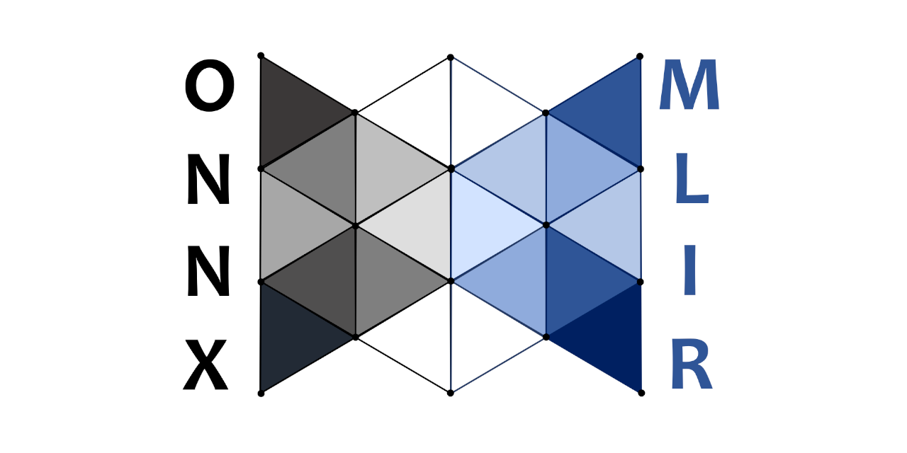

<!--- SPDX-License-Identifier: Apache-2.0 -->
<p align="center"></p>

# ONNX-MLIR

This project (https://onnx.ai/onnx-mlir/) provides compiler technology to transform a valid Open Neural Network Exchange (ONNX) graph into code that implements the graph with minimum runtime support.
It implements the [ONNX standard](https://github.com/onnx/onnx#readme) and is based on the underlying [LLVM/MLIR](https://mlir.llvm.org) compiler technology.

| System        | Build Status | Model Zoo Status |
|---------------|--------------|------------------|
| s390x-Linux   | [](https://www.onnxmlir.xyz/jenkins/job/ONNX-MLIR-Pipeline-Docker-Build/) | [](https://www.onnxmlir.xyz/jenkins/job/ONNX-MLIR-Pipeline-Docker-Build/Model_20Zoo_20Report/) |
| ppc64le-Linux | [](https://www.onnxmlir.xyz/jenkinp/job/ONNX-MLIR-Pipeline-Docker-Build/) | [](https://www.onnxmlir.xyz/jenkinp/job/ONNX-MLIR-Pipeline-Docker-Build/Model_20Zoo_20Report/) |
| amd64-Linux   | [](https://www.onnxmlir.xyz/jenkinx/job/ONNX-MLIR-Pipeline-Docker-Build/) | [](https://www.onnxmlir.xyz/jenkinx/job/ONNX-MLIR-Pipeline-Docker-Build/Model_20Zoo_20Report/) |
| amd64-Windows | [](https://dev.azure.com/onnx-pipelines/onnx/_build/latest?definitionId=9&branchName=main) | |
| amd64-macOS   | [](https://github.com/onnx/onnx-mlir/actions/workflows/macos-amd64-build.yml) |
| | [](https://bestpractices.coreinfrastructure.org/projects/5549) |

This project contributes:
* an ONNX Dialect that can be integrated in other projects,
* a compiler interfaces that lower ONNX graphs into MLIR files/LLVM bytecodes/C & Java libraries,
* an `onnx-mlir` driver to perform these lowering,
* and a python/C/C++/Java runtime environment.

Current levels of support for the code generation of ONNX operations are listed here for
[a generic CPU](docs/SupportedONNXOps-cpu.md) and
[IBM's Telum integrated AI accelerator](docs/SupportedONNXOps-NNPA.md).

## Interacting with the community.

For ongoing discussions, we use an [`#onnx-mlir-discussion`](https://lfaifoundation.slack.com/archives/C01J4NAL4A2) slack channel established under the Linux Foundation AI and Data Workspace.
Join this workspace using this [link](https://join.slack.com/t/lfaifoundation/shared_invite/zt-o65errpw-gMTbwNr7FnNbVXNVFkmyNA).

We use GitHub Issues for request for comments, questions, or bug reports.
Security-related issues are reported using the channels listed in the [SECURITY](SECURITY.md) page.

We hold informal weekly meetings on Tuesdays where we discuss  current issues and progress. Meeting agenda, notes, and links (to participate) are found [here](https://github.com/onnx/onnx-mlir/wiki/Informal-meeting-agenda-and-notes). Please email alexe@us.ibm.com to request a 15-30 min time slot to discuss a specific topic of interest.

## Setting up ONNX-MLIR using Prebuilt Containers

The preferred approach to using and developing ONNX-MLIR is to use Docker Images and Containers, as getting the proper code dependences may be tricky on some systems. Our instructions on using ONNX-MLIR with Dockers are [here](docs/Docker.md).

If you intend to develop code, you should look at our [workflow](docs/Workflow.md) document which help you setup your Docker environment in a way that let you contribute code easily.

## Setting up ONNX-MLIR directly

ONNX-MLIR runs natively on Linux, OSX, and Windows.
Detailed instructions are provided below.

### Prerequisites

<!-- Keep list below in sync with docs/Prerequisite.md. -->
```
python >= 3.8
gcc >= 6.4
protobuf >= 4.21.12
cmake >= 3.13.4
make >= 4.2.1 or ninja >= 1.10.2
java >= 1.11 (optional)
```

All the `PyPi` package dependencies and their appropriate versions are captured in [requirements.txt](requirements.txt).

Look [here](docs/Prerequisite.md) for help to set up the prerequisite software.

At any point in time, ONNX-MLIR depends on a specific commit of the LLVM project that has been shown to work with the project.
Periodically the maintainers need to move to a more recent LLVM level.
Among other things, this requires to update the LLVM commit string in [clone-mlir.sh](utils/clone-mlir.sh).
When updating ONNX-MLIR, it is good practice to check that the commit string of the MLIR/LLVM is the same as the one listed in that file. See instructions [here](docs/BuildONNX.md) when third-party ONNX also need to be updated.

### Build

Directions to install MLIR and ONNX-MLIR are dependent on your OS.
* [Linux or OSX](docs/BuildOnLinuxOSX.md).
* [Windows](docs/BuildOnWindows.md).

After installation, an `onnx-mlir` executable should appear in the `build/Debug/bin` or `build/Release/bin` directory.

If you have difficulties building, rebuilding, or testing `onnx-mlir`, check this [page](docs/TestingHighLevel.md) for helpful hints.


## Using ONNX-MLIR

The usage of `onnx-mlir` is as such:

```
OVERVIEW: ONNX-MLIR modular optimizer driver

USAGE: onnx-mlir [options] <input file>

OPTIONS:

Generic Options:

  --help        - Display available options (--help-hidden for more)
  --help-list   - Display list of available options (--help-list-hidden for more)
  --version     - Display the version of this program

ONNX-MLIR Options:
These are frontend options.

  Choose target to emit:
      --EmitONNXBasic - Ingest ONNX and emit the basic ONNX operations without inferred shapes.
      --EmitONNXIR    - Ingest ONNX and emit corresponding ONNX dialect.
      --EmitMLIR      - Lower the input to MLIR built-in transformation dialect.
      --EmitLLVMIR    - Lower the input to LLVM IR (LLVM MLIR dialect).
      --EmitObj       - Compile the input to an object file.
      --EmitLib       - Compile and link the input into a shared library (default).
      --EmitJNI       - Compile the input to a jar file.

  Optimization levels:
      --O0           - Optimization level 0 (default).
      --O1           - Optimization level 1.
      --O2           - Optimization level 2.
      --O3           - Optimization level 3.
```

The full list of options is given by the `-help` option.
The `-` and the `--` prefix for flags can be used interchangeably.
Note that just as most compilers, the default optimization level is `-O0`.
We recommend using `-O3` for most applications.

Options are also read from the `ONNX_MLIR_FLAGS` environment variable. For example, `ONNX_MLIR_FLAGS="-O3"` will ensure `-O3` for all compilations.

### Simple Example

For example, use the following command to lower an ONNX model (e.g., add.onnx) to ONNX dialect:
```shell
./onnx-mlir --EmitONNXIR add.onnx
```
The output should look like:
```mlir
module {
  func.func @main_graph(%arg0: tensor<10x10x10xf32>, %arg1: tensor<10x10x10xf32>) -> tensor<10x10x10xf32> {
    %0 = "onnx.Add"(%arg0, %arg1) : (tensor<10x10x10xf32>, tensor<10x10x10xf32>) -> tensor<10x10x10xf32>
    return %0 : tensor<10x10x10xf32>
  }
}
```

An example based on the add operation is found [here](docs/doc_example), which build an ONNX model using a python script, and then provide a main program to load the model's value, compute, and print the models output.

### Writing a driver to perform inferences: end to end example

An end to end example is provided [here](docs/mnist_example/README.md), which train, compile, and execute a simple MNIST example using our
C/C++, Python, or Java interface.

## Documentation

Documentation is provided in the `docs` sub-directory; the [DocumentList](docs/DocumentList.md) page provides an organized list of documents. Information is also provided on our public facing
[onnx.ai/onnx-mlir](https://onnx.ai/onnx-mlir/) pages.

## Contributing

We are welcoming contributions from the community.
Please consult the [CONTRIBUTING](CONTRIBUTING.md) page for help on how to proceed.

ONNX-MLIR requires committers to sign their code using the [Developer Certificate of Origin (DCO)](https://developercertificate.org).
Practically, each `git commit` needs to be signed, see [here](docs/Workflow.md#step-7-commit--push) for specific instructions.

## Code of Conduct

The ONNX-MLIR code of conduct is described at https://onnx.ai/codeofconduct.html.

## Adopters
<!-- Please open a PR to add your company/product here. -->

* IBM [zDLC compiler](https://github.com/IBM/zDLC) uses onnx-mlir technology to transform ONNX models into executable binary for [IBM Telum](https://www.ibm.com/z/telum) servers.

## Projects related/using onnx-mlir

* The [onnx-mlir-serving](https://github.com/IBM/onnx-mlir-serving) project implements a GRPC server written with C++ to serve onnx-mlir compiled models. Benefiting from C++ implementation, ONNX Serving has very low latency overhead and high throughput.
