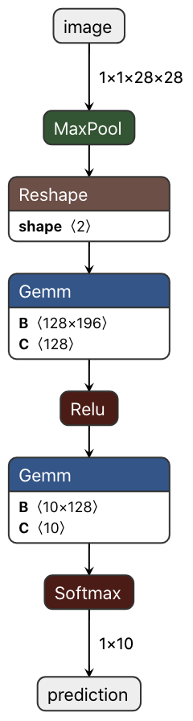

# Table of Contents

- [Train Model in PyTorch, Compile using ONNX-MLIR](#train-model-in-pytorch-compile-using-onnx-mlir)
  - [Training the Model](#training-the-model)
  - [Environment Variables Setup](#environment-variables-setup)
  - [Compile Model](#compile-model)
  - [Write a C Driver Code](#write-a-C-driver-code)
    - [Inference Entry Point](#inference-entry-point)
    - [Feeding Inputs and Retrieving Results](#feeding-inputs-and-retrieving-results)
  - [Write a Python Driver Code](#write-a-Python-driver-code)
  - [Write a Java Driver Code](#write-a-java-driver-code)

# Train Model in PyTorch, Compile using ONNX-MLIR

In this example, we will demonstrate training a mnist model in PyTorch and compile, run it using only C++.

## Training the Model

An already trained [mnist.onnx](mnist.onnx) model is provided for your convenience.

If you want to train the model yourself, make sure that dependent python packages specified in `requirements.txt` are installed.
Run the training script using the following command:

```bash
./gen_mnist_onnx.py --epochs=1 --batch-size=128 --export-onnx --save-model
```

Which basically says, train the model for 1 epoch using a batch size of 128. Such configuration encourages a speedy training process.
The flag `--export-onnx` will export the trained model to an ONNX protobuf object.
The flag `--save-model` will save a snapshot of the trained model.

The model is a simple neural network defined as such:

```python
class Net(nn.Module):
    def __init__(self):
        super(Net, self).__init__()
        self.fc1 = nn.Linear(14*14, 128)
        self.fc2 = nn.Linear(128, 10)

    def forward(self, x):
        x = F.max_pool2d(x, 2)
        x = x.reshape(-1, 1*14*14)
        x = self.fc1(x)
        x = F.relu(x)
        x = self.fc2(x)
        output = F.softmax(x, dim=1)
        return output
```

After training is complete, an onnx model named `mnist.onnx` should appear.
If you are interested in knowing how to export a pytorch model, here's the relevant code snippet:

```python
  model = Net()
#...
#Train...
#...
  input_names = ["image"]
  output_names = ["prediction"]
  dummy_input = torch.randn(1, 1, 28, 28)
  torch.onnx.export(model,
                    dummy_input,
                    "mnist.onnx",
                    verbose=True,
                    input_names=input_names,
                    output_names=output_names)
```

Upon inspection, it should look like:



## Environment Variables Setup

Now we are ready to compile the model! To make it easier to invoke commands and include header files, I updated my environment variables as such:

```bash
#ONNX_MLIR_ROOT points to the root of the onnx-mlir,
#under which the include and the build directory lies.
export ONNX_MLIR_ROOT=$(pwd)/../..
#Define the bin directory where onnx-mlir binary resides.Change only if you
#have a non - standard install.
export ONNX_MLIR_BIN=$ONNX_MLIR_ROOT/build/Debug/bin
#Define the include directory where onnx-mlir runtime include files resides.
#Change only if you have a non - standard install.
export ONNX_MLIR_INCLUDE=$ONNX_MLIR_ROOT/include

#Include ONNX-MLIR executable directories part of $PATH.
export PATH=$ONNX_MLIR_ROOT/build/Debug/bin:$PATH

#Compiler needs to know where to find its                                      \
    runtime.Set ONNX_MLIR_RUNTIME_DIR to proper path.
export ONNX_MLIR_RUNTIME_DIR=../../build/Debug/lib
```

You may also simply execute `chmod +x update_env.sh` and `./update_env.sh` for the above commands directly in the docs/docs/mnist_example and everything should work fine.

## Compile Model

To compile the model into a shared library that can be used with C/C++ and Python drivers, we invoke `onnx-mlir` with the `-EmitLib` option (it can be omitted since it's the default):

```bash
onnx-mlir -O3 [-EmitLib] mnist.onnx
```

A `mnist.so` should appear, which corresponds to the compiled model object file. An example to compile the model via Python interface is also provided. You could also run `python3 mnist-compile.py` and you will see a `mnist.so` appears as well.

To compile the model into a jar archive that can be used with Java drivers, we invoke `onnx-mlir` with the `-EmitJNI` option:

```bash
onnx-mlir -O3 -EmitJNI mnist.onnx
```

A `mnist.jar` should appear, which corresponds to the compiled model object file along with Java API classes.

## Multi-threading

onnx-mlir provides a multi-thread safe parallel compilation mode. Whether each thread is given a name or not by the user, onnx-mlir is multi-threaded safe. If you would like to give a name to a thread, use the `-customEnvFlags` keyword and an example can be found as follows.

```bash
export MNIST_WITH_O3="-O3"
onnx-mlir -O3 -customEnvFlags=MNIST_WITH_O3 [--EmitLib] mnist.onnx -o mnist03
```

A multi-threaded experiment from command line written in Python is provided.

```python
import datetime
import os
import threading

def execCmd(cmd):
    try:
        print("command " + cmd + " starts at " + str(datetime.datetime.now()))
        os.system(cmd)
        print("command " + cmd + " is finished at " + str(datetime.datetime.now()))
    except:
        print("command " + cmd + " meets errors")

if __name__ == '__main__':

#define 2 different commands
    cmds = ['onnx-mlir -O3 mnist.onnx -o mnist03','onnx-mlir -O1 mnist.onnx -o mnist01']

    threads = []

    print("program starts at " + str(datetime.datetime.now()))

#run the commands
    for cmd in cmds:
        th = threading.Thread(target=execCmd, args=(cmd,))
        th.start()
        threads.append(th)

#wait for all the commands finish
    for th in threads:
        th.join()

    print("program is finished at " + str(datetime.datetime.now()))
```

You can execute `python3 multi-threading-test.py` under the current directory to test.

## Write a C Driver Code

Documentation of the APIs are found [here](https://onnx.ai/onnx-mlir), with the C interface for Tensor [here](https://onnx.ai/onnx-mlir/doxygen_html/OMTensor_h/_o_m_tensor_8h.html) and TensorList [here](https://onnx.ai/onnx-mlir/doxygen_html/OMTensorList_h/_o_m_tensor_list_8h.html).

To invoke the compiled model, we need to know the entry point signature with which to call into the model inference function, and based on it, engineer a C++ driver that feeds test data into this inference function and retrieve the prediction results.

### Inference Entry Point

The signature of the model inference function for all models is:

```cpp
extern "C" OMTensorList *run_main_graph(OMTensorList *);
```

I.e., all models ingests an `OMTensorList*`, and returns an `OMTensorList*`. Documentation of the APIs are found [here](https://onnx.ai/onnx-mlir/doxygen_html/OnnxMlirRuntime/index.html), with the C interface for Tensor [here](https://onnx.ai/onnx-mlir/doxygen_html/OMTensor_h/_o_m_tensor_8h.html) and TensorList [here](https://onnx.ai/onnx-mlir/doxygen_html/OMTensorList_h/_o_m_tensor_list_8h.html).

### Feeding Inputs and Retrieving Results

To invoke the inference function, we use the following code to communicate with the compiled model inference function.

```cpp
#include <iostream>
#include <vector>

#include "OnnxMlirRuntime.h"

// Declare the inference entry point.
extern "C" OMTensorList *run_main_graph(OMTensorList *);

static float img_data[] = {...};

int main() {
  // Create an input tensor list of 1 tensor.
  int inputNum = 1;
  OMTensor *inputTensors[inputNum];
  // The first input is of tensor<1x1x28x28xf32>.
  int64_t rank = 4;
  int64_t shape[] = {1, 1, 28, 28};

  // Create a tensor using omTensorCreateWithOwnership (returns a pointer to the OMTensor).
  // When the parameter, owning is set to "true", the OMTensor will free the data
  // pointer (img_data) upon destruction. If owning is set to false, the data pointer will
  // not be freed upon destruction.
  OMTensor *tensor = omTensorCreateWithOwnership(img_data, shape, rank, ONNX_TYPE_FLOAT, /*owning=*/false);

  // Create a tensor list using omTensorListCreate (returns a pointer to the OMTensorList).
  inputTensors[0] = tensor;
  OMTensorList *tensorListIn = omTensorListCreate(inputTensors, inputNum);

  // Compute outputs.
  OMTensorList *tensorListOut = run_main_graph(tensorListIn);

  // Extract the output. The model defines one output of type tensor<1x10xf32>.
  OMTensor *y = omTensorListGetOmtByIndex(tensorListOut, 0);
  float *prediction = (float *)omTensorGetDataPtr(y);

  // Analyze the output.
  int digit = -1;
  float prob = 0.;
  for (int i = 0; i < 10; i++) {
    printf("prediction[%d] = %f\n", i, prediction[i]);
    if (prediction[i] > prob) {
      digit = i;
      prob = prediction[i];
    }
  }
  // The OMTensorListDestroy will free all tensors in the OMTensorList
  // upon destruction. It is important to note, that every tensor will
  // be destroyed. To free the OMTensorList data structure but leave the
  // tensors as is, use OMTensorListDestroyShallow instead.
  omTensorListDestroy(tensorListOut);
  omTensorListDestroy(tensorListIn);

  printf("The digit is %d\n", digit);
  return 0;
}
```

Now, putting everything together, we invoke g++ to compile and link together the driver code, C runtime API and the compiled model inference function:

```bash
g++ --std=c++11 -O3 mnist.cpp ./mnist.so -o mnist -I $ONNX_MLIR_INCLUDE
```

Now run it by calling `./mnist`! It outputs the following for the image in the test:

```shell
prediction[0] = 1.000000
prediction[1] = 0.000000
prediction[2] = 0.000000
prediction[3] = 0.000000
prediction[4] = 0.000000
prediction[5] = 0.000000
prediction[6] = 0.000000
prediction[7] = 0.000000
prediction[8] = 0.000000
prediction[9] = 0.000000
The digit is 0.
```

The full code is available [here](mnist.cpp).

## Write a Python Driver Code

You will find most of the details of the Python driver interface described [here](https://onnx.ai/onnx-mlir/UsingPyRuntime.html). We summarize here quickly how to execute mnist in python.

First, we include the necessary Python runtime library. The library path can be set by using the PYTHONPATH or simply creating a soft link in the current directory to the Python shared library (typically: `build/Debug/lib/PyRuntime.cpython-<target>.so`).

```Python
import numpy as np
from PyRuntime import OMExecutionSession
```

The runtime use an `OMExecutionSession` object to hold a specific model and entry point. On this object, we can perform in inference using the `run(input)` call where `input` is a list of numpy arrays. The signature of the input and output model can be extracted using, respectively, the `input_signature()` and `output_signature()` formatted as JSON strings. The code is shown below.

```Python
#Load the model mnist.so compiled with onnx-mlir.
session = OMExecutionSession('mnist.so')
#Print the models input / output signature, for display.
#If there are problems with the signature functions,                           \
    they can be simply commented out.
print("input signature in json", session.input_signature())
print("output signature in json", session.output_signature())
#Create an input arbitrarily filled of 1.0 values(file has the actual values).
input = np.full((1, 1, 28, 28), 1, np.dtype(np.float32))
#Run the model.It is best to always use the[] around the inputs as the inputs
#are an vector of numpy arrays.
outputs = session.run([input])
```

The outputs can then be analyzed by inspecting the values inside the `output` list of numpy arrays.

The full code is available [here](mnist-runPyRuntime.py). It finds that `0` is the most likely digit for the given input. The command is:

```shell
./mnist-runPyRuntime.py
```

and produces an output similar to the following (you may see slightly different prediction numbers if you train the model yourself):

```shell
input signature in json [    { "type" : "f32" , "dims" : [1 , 1 , 28 , 28] , "name" : "image" }
]
output signature in json [   { "type" : "f32" , "dims" : [1 , 10] , "name" : "prediction" }
]
prediction  0 = 0.9999999
prediction  1 = 6.470239e-17
prediction  2 = 5.3113327e-09
prediction  3 = 2.3830837e-10
prediction  4 = 1.54674e-15
prediction  5 = 1.6361314e-07
prediction  6 = 2.7768482e-11
prediction  7 = 8.211209e-13
prediction  8 = 2.9605862e-09
prediction  9 = 8.650948e-15
The digit is 0
```

We provide two additional Python interfaces. 
The second interface extends the above execution session by simply compiling a model before loading it for execution (see [here](mnist-runPyCompileAndRuntime.py)). 
The user simply passes the `.onnx` model and the flags needed to compile the model.
Unless explicitly disabled by the `reuse_compiled_model=0`, the execution session will reuse a previously compiled model whose name matches the name the output file generated by the compiler. 
Note that the execution session does not check if the cached version was compiled using identical compiler flags; it is the responsibility of the user to then clear the cached version, or disable the reuse using the provided optional flag.

For example, the code below will compile and load the `mnist.onnx` model, compiling only when the `mnist2.so` binary file cannot be located. Model inference can then proceed using the `session.run(...)` command.

```Python
# Load onnx model and create CompileExecutionSession object,
# by first compiling the mnist.onnx model with the "-O3" options.
session = OMCompileExecutionSession("./mnist.onnx" ,"-O3 -o=mnist2")
```

The third interface provides a simple interface to explicitly compile an onnx model (see [here](mnist-compile.py)). 

## Write a Java Driver Code

Inference APIs and data structures for Java closely mirror those for C/C++. Documentation of the APIs are found [here](https://onnx.ai/onnx-mlir/doxygen_html/OMModel_java/classcom_1_1ibm_1_1onnxmlir_1_1_o_m_model.html), with the Java interface for Tensor [here](https://onnx.ai/onnx-mlir/doxygen_html/OMTensor_java/classcom_1_1ibm_1_1onnxmlir_1_1_o_m_tensor.html) and TensorList [here](https://onnx.ai/onnx-mlir/doxygen_html/OMTensorList_java/classcom_1_1ibm_1_1onnxmlir_1_1_o_m_tensor_list.html).

An example Java driver for the mnist model is given below.

```java
import com.ibm.onnxmlir.OMModel;
import com.ibm.onnxmlir.OMTensor;
import com.ibm.onnxmlir.OMTensorList;

public class Mnist {
  static float[] img_data = {...};

public
  static void main(String[] args) {
    // Create an input tensor list of 1 tensor.
    // The first input is of tensor<1x1x28x28xf32>.
    OMTensor tensor = new OMTensor(img_data, new long[]{1, 1, 28, 28});
    OMTensor[] inputTensors = new OMTensor[]{tensor};
    // Create a tensor list
    OMTensorList tensorListIn = new OMTensorList(inputTensors);

    // Compute outputs.
    OMTensorList tensorListOut = OMModel.mainGraph(tensorListIn);

    // Extract the output. The model defines one output of type
    // tensor<1x10xf32>.
    OMTensor y = tensorListOut.getOmtByIndex(0);
    float[] prediction = y.getFloatData();

    // Analyze the output.
    int digit = -1;
    float prob = 0.f;
    for (int i = 0; i < prediction.length; i++) {
      System.out.println("prediction[" + i + "] = " + prediction[i]);
      if (prediction[i] > prob) {
        digit = i;
        prob = prediction[i];
      }
    }

    System.out.println("The digit is " + digit);
  }
}
```

The full code is [here](Mnist.java).

To compile the driver:

```
javac -cp mnist.jar Mnist.java
```

To run the driver:

```
java -cp .:mnist.jar Mnist
```

It should produce an output similar to the following:

```
prediction[0] = 0.9999999
prediction[1] = 6.470239E-17
prediction[2] = 5.3113327E-9
prediction[3] = 2.3830837E-10
prediction[4] = 1.54674E-15
prediction[5] = 1.6361314E-7
prediction[6] = 2.7768482E-11
prediction[7] = 8.211209E-13
prediction[8] = 2.9605862E-9
prediction[9] = 8.650948E-15
The digit is 0
```
